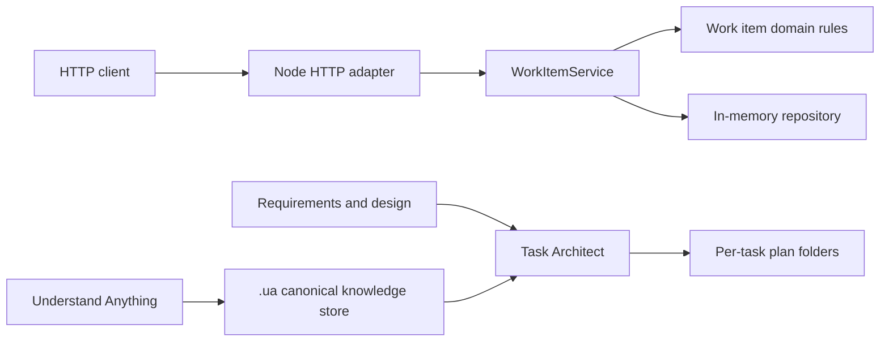

# System context

## Runtime boundaries

- The HTTP adapter translates requests and errors.
- The service coordinates domain and repository behavior.
- Domain functions are pure and clock-injectable.
- The repository owns storage and query operations.
